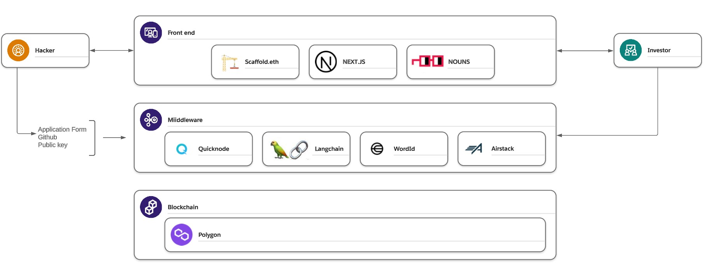
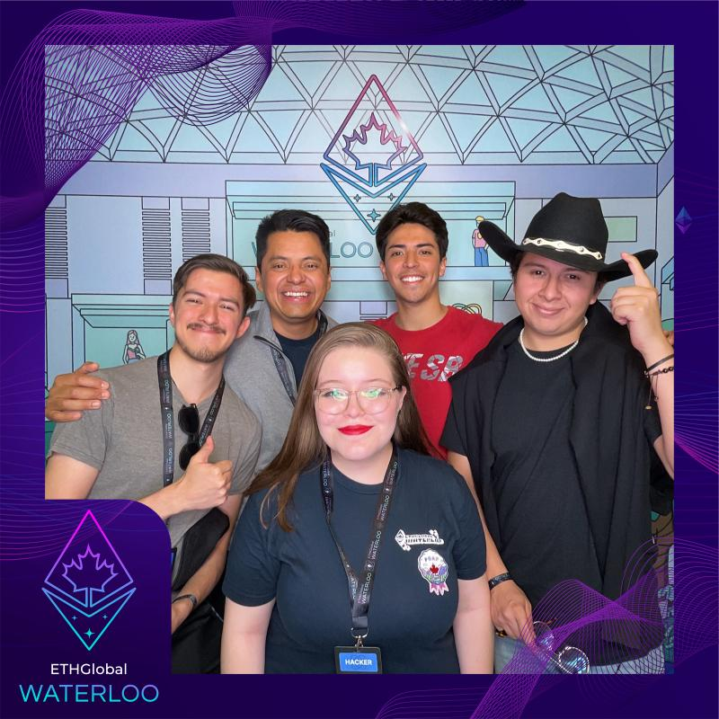

# The Hacker Grant Repository

     
    
     

## Description
This repository contains the source code and related resources for The Hacker Grant, a Web3 crowdfunding platform designed support talented hackers. 
## Problem
While the Ethereum developer community is expanding and thriving, many hackers and aspiring developers cannot afford to attend global hackathons. Resolving this lack of resources, would allow hackers:
 
- To networking in person
- To learn about the latest advancements
- Get valuable insights and practical experience

At the same time, for those who support hackers, would allow them to:

- Increase engagement with their projects
- Have direct access to talent pool
- Keep fostering the strong sense of community

## Proposed Solution

Our solution consist in a crowfunding platform to connect hackers and supporters 

1. The hacker sign up in the platform and provide some basic info, his github link and his public address, the system assess the hacker using a large language model, if the hacker is approved his profile is published in the platform
2. Supporters sign up in the platform and check the published hackers profiles and select those who want to support, they transfer the resources from their wallets to a escrow account created with a smart contract and hold the resources until the hacker's campaign is finished
3. When the requested amount is reached, the platform transfers the balance to the hacker's wallet and he can use the resources to cover his trip's expenses  

## Platform Components

     
        
     

The Platform consists of the following main components:
1.	**Scaffold.eth** This displays the main concerts and provides various search options to find other available events.
2.	**NEXT.js** To ensure compliance with the established requirements, users will be required to log in to Spotify to verify their affinity 
3.	**Nouns:** Once authenticated, users can choose their preferred show and select a specific date on which the artist will perform.
4.	**Quicknode:** After choosing the date, users can select the preferred zone and seat within the event venue.
5.	**Langchain** Once the selections are complete, users will proceed to make the corresponding payment to acquire the chosen tickets.
6. **WordID** This bot provides in-venue, real world feedback and functionalities. As of now, we can control a local plug, used as 
7. **Airstack** Th
8. **Polygon** Th

## Our Source
1. Web Page: https://hackergrant-gergodfrey.vercel.app/
2. Pitch Deck: https://docs.google.com/presentation/d/1G0yVV3pKGYza3zQVh9iyFlfafEisoh4rjYtnfoAO5CE/edit?usp=sharing
3. Final Design Figma https://www.figma.com/file/nUbB6dd0KzDWUIWMu5cR21/FanLane?type=design&node-id=1003-22493&t=pA1L3lfjZQJjtO5b-0 

## Our Repos 
1.https://github.com/GerGodfrey/HackerGrant
## SC Info
    TBD
    TBD
## Contribution
We welcome any contributions to the development and improvement of The Hacker Grant! If you would like to contribute, please follow these steps:
1.	Clone this repository to your local machine.
2.	Make the necessary changes or improvements. 
3.	Ensure thorough testing of the changes.
4.	Create a detailed pull request explaining the changes made and their purpose.
## Team
Danya
Francisco 
Diego
Gerardo
Gustavo

     
    
     

   

